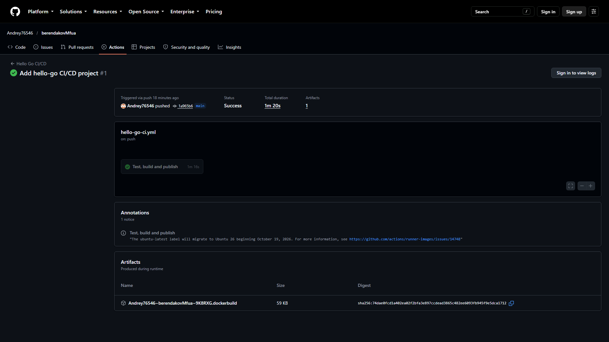
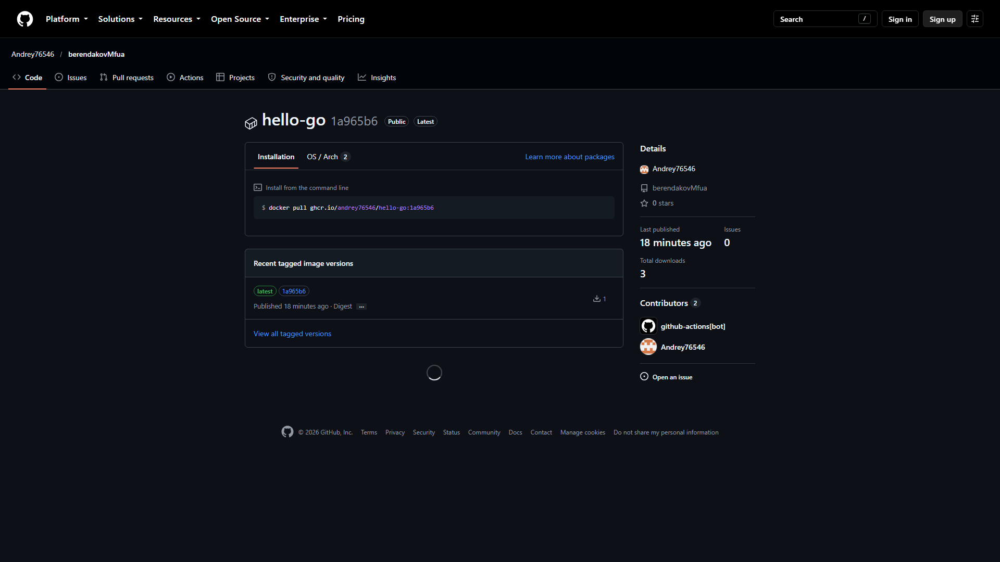

# Практическая работа: CI/CD на Go с публикацией в GHCR

## Цель работы

Настроить полный CI/CD-цикл для Go-приложения: автоматическую проверку форматирования, статический анализ, тесы, сборку бинарного файла и Docker-образа, а также публикацию готового образа в GitHub Container Registry.

## Используемые технологии

- Go 1.23 и встроенные средства `gofmt`, `go vet`, `go test`;
- Git и GitHub;
- GitHub Actions;
- Docker и multi-stage Dockerfile;
- GitHub Container Registry (GHCR).

## Требования к рабочему месту

Для локального выполнения нужны Git, Docker Desktop с WSL 2 на Windows или Docker на Linux, а также редактор VS Code или аналогичный. Локальная установка Go не обязательна: тесты и сборку можно запустить в официальном Docker-образе `golang:1.23-alpine`.

## Краткое описание выполнения

1. Создан Go-модуль `hello-go` с пакетом `greeting`.
2. Добавлены табличные тесты для `Greet` и `SumRange`.
3. Создан multi-stage Dockerfile: сборка в `golang:1.23-alpine`, запуск от непривилегированного пользователя в `alpine:3.20`.
4. В GitHub Actions настроены `gofmt`, `go vet`, тесты, сборка и smoke-тест.
5. При push в `main` Docker-образ автоматически публикуется в GHCR с тегами `latest` и коротким SHA коммита.

## Результаты тесирования

- `gofmt` — файлы отформатированы;
- `go vet ./...` — ошибок не найдено;
- `go test -v -cover ./...` — все тесты пройдены, покрытие пакета `greeting` составило 100%;
- локальная сборка и запуск Docker-образа — успешно;
- GitHub Actions — все шаги выполнены успешно;
- образ `ghcr.io/andrey76546/hello-go` опубликован и доступен публично.

## Результат автоматической сборки CI/CD

[Открыть workflow Hello Go CI/CD](https://github.com/Andrey76546/berendakovMfua/actions/workflows/hello-go-ci.yml)

[](https://github.com/Andrey76546/berendakovMfua/actions/runs/37916973735)

## Публикация Docker-образа в GHCR

[Открыть пакет `hello-go` в GHCR](https://github.com/Andrey76546/berendakovMfua/pkgs/container/hello-go)

[](https://github.com/Andrey76546/berendakovMfua/pkgs/container/hello-go)

## Запуск из GHCR

```shell
docker pull ghcr.io/andrey76546/hello-go:latest
docker run --rm ghcr.io/andrey76546/hello-go:latest
```

## Ссылки

- [Исходный код](https://github.com/Andrey76546/berendakovMfua/tree/main/hello-go)
- [Workflow CI/CD](https://github.com/Andrey76546/berendakovMfua/actions/workflows/hello-go-ci.yml)
- [Docker-образ в GHCR](https://github.com/Andrey76546/berendakovMfua/pkgs/container/hello-go)

## Вывод

Настроен и проверен CI/CD-конвейер, который автоматизирует проверку Go-кода, сборку приложения и публикацию готового Docker-образа в GHCR. Образ можно скачать и запустить на любой машине с Docker.

> Для полной сдачи работы необходимо самостоятельно предоставить преподавателю отдельный скриншот статистики слепой печати.
