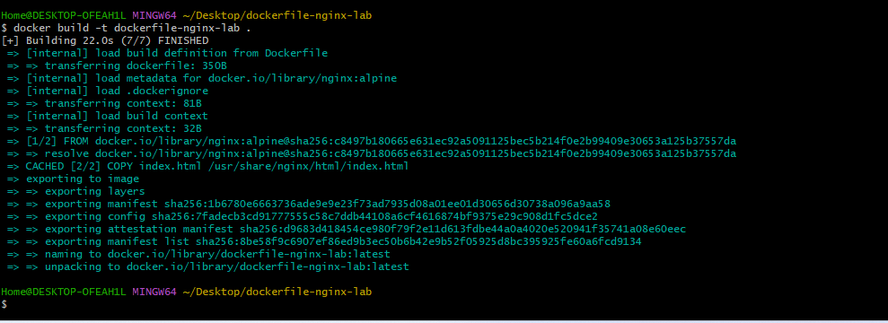
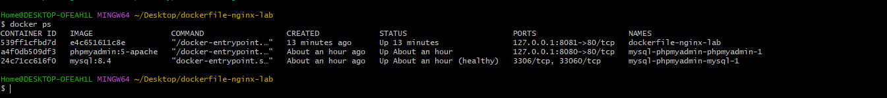
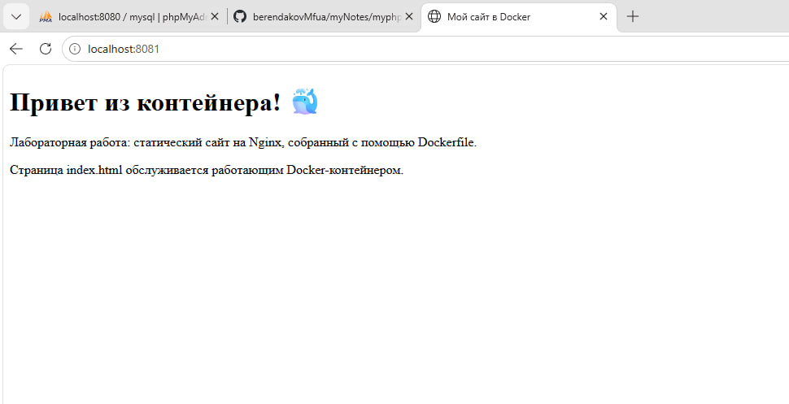

# Dockerfile: статический сайт на Nginx

## Цель работы

Выполнить первое задание преподавателя по Dockerfile: создать HTML-страницу, собрать собственный образ на базе Nginx, запустить контейнер и проверить сайт через localhost.

Проект находится в `C:\Users\Home\Desktop\dockerfile-nginx-lab`. Выполнено только задание со статическим сайтом. Отчёт подготовлен по [руководству преподавателя](https://github.com/Andrey76546/berendakovMfua/blob/fef376cbd36b741f915fae01b0a3f029eeb7d70b/content/Docker/Dockerfile/my-site.md).

## Краткие сведения

**Docker** — платформа для сборки образов и запуска приложений в контейнерах. Образ содержит файлы приложения и его окружение, а контейнер представляет собой запущенный экземпляр образа с изолированными процессами и файловой системой.

**Dockerfile** — текстовый файл с инструкциями, по которым Docker собирает образ. В этой работе он задаёт базовый образ и добавляет HTML-страницу в каталог веб-сервера.

**Nginx** — веб-сервер, который принимает HTTP-запросы и возвращает страницы и другие файлы. В лабораторной он обслуживает статический файл `index.html`.

## Структура проекта

```text
dockerfile-nginx-lab/
├── .dockerignore
├── Dockerfile
├── index.html
└── README.md
```

Файл `.dockerignore` ограничивает контекст сборки файлами Dockerfile, index.html и .dockerignore. Файл README.md содержит локальный отчёт.

В учебном репозитории отчёт и скриншоты размещены отдельно:

```text
myNotes/
├── dockerfile-nginx.md
└── images/
    ├── dockerfile-nginx-build.png
    ├── dockerfile-nginx-ps.png
    └── dockerfile-nginx-site.png
```

В этой схеме показаны только файлы данной лабораторной.

## Содержимое Dockerfile

Ниже приведено содержимое реального файла проекта:

```dockerfile
# Используем официальный легковесный образ Nginx
FROM nginx:alpine

# Копируем HTML-файл в стандартную директорию Nginx
COPY index.html /usr/share/nginx/html/index.html

# Документируем порт веб-сервера
EXPOSE 80
```

| Инструкция | Назначение |
| --- | --- |
| `FROM nginx:alpine` | Использует официальный образ Nginx на базе Alpine Linux |
| `COPY index.html /usr/share/nginx/html/index.html` | Копирует HTML-файл из контекста сборки в каталог сайта внутри образа |
| `EXPOSE 80` | Документирует порт веб-сервера внутри контейнера |

Команда запуска Nginx наследуется от базового образа. Инструкция `EXPOSE` сама по себе не публикует порт на компьютере: это делает параметр `-p` команды `docker run`.

## Содержимое index.html

Реальный HTML-файл проекта:

```html
<!DOCTYPE html>
<html lang="ru">
<head>
    <meta charset="UTF-8">
    <meta name="viewport" content="width=device-width, initial-scale=1.0">
    <title>Мой сайт в Docker</title>
</head>
<body>
    <h1>Привет из контейнера! 🐳</h1>
    <p>Лабораторная работа: статический сайт на Nginx, собранный с помощью Dockerfile.</p>
    <p>Страница index.html обслуживается работающим Docker-контейнером.</p>
</body>
</html>
```

Кодировка UTF-8 обеспечивает корректное отображение русского текста. На странице размещены заголовок «Привет из контейнера! 🐳» и описание работы.

## Сборка Docker-образа

При работающем Docker Desktop открыть PowerShell и перейти в папку проекта:

```powershell
Set-Location C:\Users\Home\Desktop\dockerfile-nginx-lab
docker build -t dockerfile-nginx-lab .
```

Флаг `-t` задаёт имя образа. Если тег не указан явно, используется `latest`. Точка обозначает текущую папку как контекст сборки.

Сборка завершилась успешно. Создан образ `dockerfile-nginx-lab:latest`. При повторной сборке шаг `COPY` использовал кеш, а Docker сообщил `FINISHED`.

### Скриншот успешной сборки



*Рисунок 1. Docker-образ успешно собран из Dockerfile.*

## Запуск контейнера

Из папки проекта в PowerShell выполнена команда:

```powershell
docker run -d --name dockerfile-nginx-lab -p 127.0.0.1:8081:80 -v "${PWD}:/usr/share/nginx/html:ro" dockerfile-nginx-lab:latest
```

| Параметр | Назначение |
| --- | --- |
| `-d` | Запускает контейнер в фоновом режиме |
| `--name dockerfile-nginx-lab` | Задаёт имя контейнера |
| `-p 127.0.0.1:8081:80` | Связывает локальный порт 8081 с портом 80 контейнера |
| `-v "${PWD}:/usr/share/nginx/html:ro"` | Подключает текущую папку проекта к каталогу сайта в режиме чтения |
| `dockerfile-nginx-lab:latest` | Указывает образ для запуска |

Проброс `8081:80` означает: браузер обращается к порту **8081 компьютера**, а Docker передаёт запрос на порт **80 контейнера**, где работает Nginx. Адрес `127.0.0.1` ограничивает публикацию локальным компьютером.

HTML включён в образ инструкцией `COPY`. Подключение папки, как в примере преподавателя, перекрывает каталог сайта во время работы контейнера и позволяет видеть изменения локальной страницы после обновления браузера. Параметр `ro` запрещает контейнеру изменять подключённые файлы.

Эта команда записана для воспроизведения работы. Работающий контейнер повторно создавать не требуется. Для запуска уже существующего остановленного контейнера используется `docker start dockerfile-nginx-lab`.

## Проверка контейнера

```powershell
docker ps
```

В выводе присутствует контейнер `dockerfile-nginx-lab` со статусом `Up` и публикацией порта `127.0.0.1:8081->80/tcp`.

### Скриншот docker ps



*Рисунок 2. Контейнер запущен и обслуживает локальный порт 8081.*

После повторной сборки в колонке IMAGE может отображаться идентификатор исходного образа: уже работающий контейнер продолжает использовать образ, из которого был создан. Контейнер не останавливался и не пересоздавался.

## Проверка сайта

Сайт открыт по адресу [http://localhost:8081](http://localhost:8081). В браузере отображаются заголовок «Привет из контейнера! 🐳» и текст лабораторной.

Проверка HTTP-ответа в PowerShell:

```powershell
(Invoke-WebRequest -Uri http://localhost:8081).StatusCode
```

Полученный результат:

```text
200
```

### Скриншот работающего сайта



*Рисунок 3. HTML-страница успешно открывается через Nginx в Docker-контейнере.*

### Результаты проверки

| Проверка | Результат |
| --- | --- |
| Сборка | Успешная, образ `dockerfile-nginx-lab:latest` создан |
| Контейнер | `dockerfile-nginx-lab`, статус `Up` |
| Порт | `127.0.0.1:8081->80/tcp` |
| HTTP-ответ | `200` |
| Содержимое сайта | Найден ожидаемый заголовок «Привет из контейнера!» |
| Конфигурация Nginx | Ранее проверена командой `nginx -t`: ошибок нет |
| Копия HTML в образе | Ранее проверено совпадение SHA256 с локальным `index.html` |

При подготовке этого отчёта повторно подтверждены состояние `running`, ответ HTTP 200 и наличие ожидаемого заголовка.

## Полезные команды Docker

Команды ниже выполняются в терминале; команды сборки — из папки проекта.

| Команда | Назначение |
| --- | --- |
| `docker image ls dockerfile-nginx-lab` | Показать образ лабораторной |
| `docker ps` | Показать работающие контейнеры |
| `docker ps -a` | Показать все контейнеры, включая остановленные |
| `docker logs dockerfile-nginx-lab` | Просмотреть журналы Nginx |
| `docker logs -f dockerfile-nginx-lab` | Следить за журналом; Ctrl+C завершает просмотр |
| `docker exec dockerfile-nginx-lab nginx -t` | Проверить конфигурацию Nginx |
| `docker port dockerfile-nginx-lab` | Показать опубликованные порты |
| `docker inspect dockerfile-nginx-lab` | Посмотреть подробные сведения о контейнере |
| `docker stop dockerfile-nginx-lab` | Остановить контейнер |
| `docker start dockerfile-nginx-lab` | Запустить существующий остановленный контейнер |

## Остановка контейнера

После завершения демонстрации контейнер можно остановить:

```powershell
docker stop dockerfile-nginx-lab
```

## Удаление контейнера

После остановки:

```powershell
docker rm dockerfile-nginx-lab
```

Удаляется только контейнер этой лабораторной. Файлы проекта на Desktop сохраняются.

## Удаление образа

Если образ больше не нужен, после удаления использующих его контейнеров:

```powershell
docker image rm dockerfile-nginx-lab:latest
```

Команды остановки и удаления приведены как справочные. При подготовке и публикации отчёта они не выполнялись; сайт оставлен работающим.

## Вывод

Выполнено первое задание по Dockerfile: создан статический сайт, написан Dockerfile на базе Nginx, собран образ и запущен контейнер. Проверки docker ps и HTTP 200 подтвердили работоспособность сайта на localhost:8081. Успешная сборка, состояние контейнера и результат в браузере показаны на трёх скриншотах.
