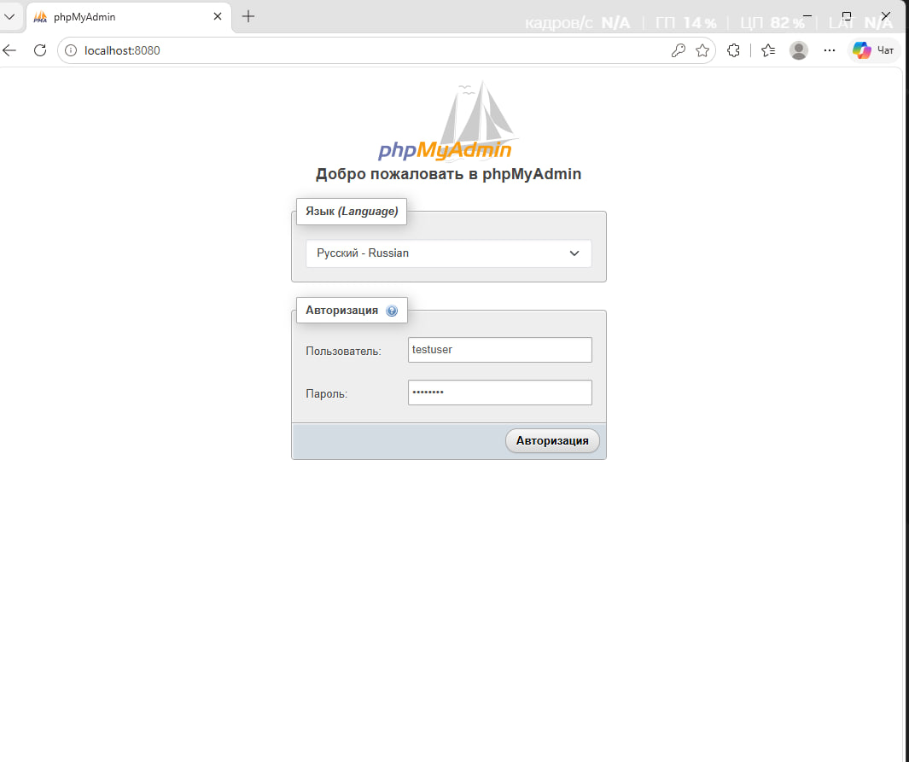
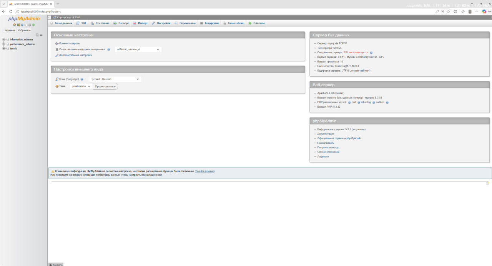

# Docker Compose: MySQL + phpMyAdmin

## Цель работы

Развернуть MySQL и phpMyAdmin с помощью Docker Compose, создать базу данных `testdb` и проверить доступ к ней через веб-интерфейс.

## Краткие теоретические сведения

- **MySQL** — система управления реляционными базами данных. Она хранит данные в таблицах и позволяет работать с ними с помощью языка SQL.
- **phpMyAdmin** — веб-интерфейс для управления MySQL. Через браузер можно просматривать базы и таблицы, изменять данные и выполнять SQL-запросы.
- **Docker Compose** — инструмент для описания и совместного запуска нескольких контейнеров. Сервисы, их настройки, сеть и тома задаются в файле `compose.yaml`.

## Структура проекта

```text
mysql-phpmyadmin/
├── compose.yaml
├── README.md
└── images/
    ├── phpmyadmin-login.png
    └── phpmyadmin-home.png
```

Файл `compose.yaml` содержит конфигурацию сервисов, а `README.md` — отчёт по лабораторной работе. Данные MySQL хранятся в именованном томе `mysql_data`, которым управляет Docker.

## Конфигурация Docker Compose

Содержимое текущего файла `compose.yaml`:

```yaml
services:
  mysql:
    image: mysql:8.4
    restart: unless-stopped
    environment:
      MYSQL_ROOT_PASSWORD: rootpass
      MYSQL_DATABASE: testdb
      MYSQL_USER: testuser
      MYSQL_PASSWORD: testpass
    volumes:
      - mysql_data:/var/lib/mysql
    healthcheck:
      test: ["CMD-SHELL", "MYSQL_PWD=$$MYSQL_PASSWORD mysql --host=127.0.0.1 --user=$$MYSQL_USER --database=$$MYSQL_DATABASE --execute='SELECT 1' --silent"]
      interval: 5s
      timeout: 5s
      retries: 30
      start_period: 30s

  phpmyadmin:
    image: phpmyadmin:5-apache
    restart: unless-stopped
    ports:
      - "127.0.0.1:8080:80"
    environment:
      PMA_HOST: mysql
      PMA_PORT: 3306
    depends_on:
      mysql:
        condition: service_healthy

volumes:
  mysql_data:
```

Сервис `mysql` использует официальный образ `mysql:8.4`. При первоначальной инициализации создаются база `testdb` и пользователь `testuser` с паролем `testpass` и правами на эту базу.

Сервис `phpmyadmin` подключается к MySQL по имени сервиса `mysql` на порту `3306`. Запуск phpMyAdmin происходит после успешной проверки готовности базы: `healthcheck` выполняет запрос `SELECT 1`. Порт `80` контейнера phpMyAdmin опубликован на локальном адресе `127.0.0.1:8080`.

## Запуск проекта

При работающем Docker Desktop выполнить команду из папки `mysql-phpmyadmin`:

```bash
docker compose up -d
```

Команда создаёт и запускает сервисы в фоновом режиме. При первом запуске Docker загружает необходимые образы и инициализирует базу данных.

## Проверка контейнеров

```bash
docker compose ps
```

При выполнении лабораторной работы получены следующие результаты:

| Контейнер | Состояние | Назначение |
| --- | --- | --- |
| `mysql-phpmyadmin-mysql-1` | `Up (healthy)` | Сервер MySQL с базой `testdb` |
| `mysql-phpmyadmin-phpmyadmin-1` | `Up` | Веб-интерфейс на порту `8080` |

Дополнительно проверено подключение пользователя `testuser` к базе `testdb`. Страница phpMyAdmin по адресу `http://localhost:8080` вернула HTTP-код `200`.

### Скриншот работающих контейнеров

<!-- Вставить скриншот сюда -->

## Доступ к phpMyAdmin

Открыть в браузере [http://localhost:8080](http://localhost:8080) и войти с указанными данными:

| Параметр | Значение |
| --- | --- |
| Адрес | `http://localhost:8080` |
| База данных | `testdb` |
| Логин | `testuser` |
| Пароль | `testpass` |

После входа выбрать базу `testdb` в списке баз данных. Подключение к серверу `mysql` задано в конфигурации проекта.

### Скриншот страницы авторизации phpMyAdmin



На странице авторизации указан пользователь `testuser`; phpMyAdmin открыт по адресу `localhost:8080`.

### Скриншот главной страницы phpMyAdmin после входа



После успешного входа отображается главная страница phpMyAdmin: справа показаны сведения о сервере `mysql`, а слева в списке баз данных доступна `testdb`. Скриншот подтверждает подключение phpMyAdmin к MySQL.

## Полезные команды

Все команды выполняются из папки проекта.

| Команда | Назначение |
| --- | --- |
| `docker compose ps` | Показать состояние контейнеров проекта |
| `docker compose logs` | Показать журналы всех сервисов |
| `docker compose logs -f` | Следить за новыми сообщениями в журналах; `Ctrl+C` завершает просмотр |
| `docker compose stop` | Остановить контейнеры, сохранив их для последующего запуска |
| `docker compose start` | Запустить ранее остановленные контейнеры |
| `docker compose down` | Остановить и удалить контейнеры и сеть проекта; именованный том с данными сохраняется |

## Остановка проекта

Для завершения работы с проектом используется команда:

```bash
docker compose down
```

Без параметра `-v` именованный том с данными MySQL сохраняется. Для повторного создания и запуска контейнеров используется `docker compose up -d`.

При подготовке этого отчёта команда остановки не выполнялась: контейнеры и данные сохранены.

## Вывод

В ходе лабораторной работы успешно запущены два контейнера: MySQL и phpMyAdmin. Создана база данных `testdb`, phpMyAdmin подключён к MySQL и доступен через браузер по адресу `http://localhost:8080`. Проверены состояние контейнеров, доступ пользователя к базе данных и ответ веб-интерфейса.
